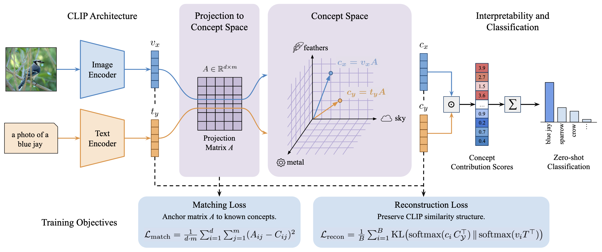

<h1 align="center">[CVPR 2026] Explaining CLIP Zero-shot Predictions Through Concepts (EZPC)</h1>

  Onat Ozdemir, Anders Christensen, Stephan Alaniz, Zeynep Akata, Emre Akbas

  
  

## Abstract
Large-scale vision-language models such as CLIP have achieved remarkable success in zero-shot image recognition, yet their predictions remain largely opaque to human understanding. In contrast, Concept Bottleneck Models provide interpretable intermediate representations by reasoning through human-defined concepts, but they rely on concept supervision and lack the ability to generalize to unseen classes.  We introduce EZPC that bridges these two paradigms by explaining CLIP’s zero-shot predictions through human-understandable concepts. Our method projects CLIP’s joint image-text embeddings into a concept space learned from language descriptions, enabling faithful and transparent explanations without additional supervision. The model learns this projection via a combination of alignment and reconstruction objectives, ensuring that concept activations preserve CLIP’s semantic structure while remaining interpretable. Extensive experiments on five benchmark datasets, CIFAR-100, CUB-200-2011, Places365, ImageNet-100, and ImageNet-1k, demonstrate that our approach maintains CLIP’s strong zero-shot classification accuracy while providing meaningful concept-level explanations. By grounding open-vocabulary predictions in explicit semantic concepts, our method offers a principled step toward interpretable and trustworthy vision-language models.

## Methodology

Code coming soon...