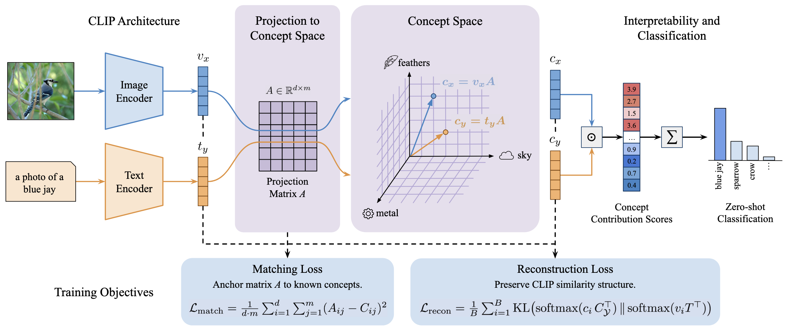

<div align="center">

# [CVPR 2026] Explaining CLIP Zero-shot Predictions Through Concepts (EZPC)

[](https://arxiv.org/abs/2603.28211) [](https://oonat.github.io/ezpc) [](https://huggingface.co/oonat/ezpc-checkpoints) [](https://huggingface.co/datasets/oonat/ezpc-embeddings)



**[Onat Ozdemir](https://oonat.github.io/)**<sup>*</sup> • 
**[Anders Christensen](https://scholar.google.com/citations?user=z7WhDRIAAAAJ)** • 
**[Stephan Alaniz](https://scholar.google.com/citations?user=mzZa_yQAAAAJ)** • 
**[Zeynep Akata](https://www.helmholtz-munich.de/en/eml/zeynep-akata)** • 
**[Emre Akbas](https://user.ceng.metu.edu.tr/~emre/)**

<sup>*</sup>Corresponding author: `onat.ozdemir [at] ed.ac.uk`

</div>

## News
- **[2026-04-09]** 🎉 We will present EZPC also in **The 5th Explainable AI for Computer Vision (XAI4CV) Workshop** at CVPR 2026.
- **[2026-02-21]** 🎉 Our paper was accepted to **CVPR 2026 (Main)**.


## Abstract

Large-scale vision-language models such as CLIP have achieved remarkable success in zero-shot image recognition, yet their predictions remain largely opaque to human understanding. In contrast, Concept Bottleneck Models provide interpretable intermediate representations by reasoning through human-defined concepts, but they rely on concept supervision and lack the ability to generalize to unseen classes. We introduce EZPC that bridges these two paradigms by explaining CLIP's zero-shot predictions through human-understandable concepts. Our method projects CLIP's joint image-text embeddings into a concept space learned from language descriptions, enabling faithful and transparent explanations without additional supervision. The model learns this projection via a combination of alignment and reconstruction objectives, ensuring that concept activations preserve CLIP's semantic structure while remaining interpretable. Extensive experiments on five benchmark datasets, CIFAR-100, CUB-200-2011, Places365, ImageNet-100, and ImageNet-1k, demonstrate that our approach maintains CLIP's strong zero-shot classification accuracy while providing meaningful concept-level explanations. By grounding open-vocabulary predictions in explicit semantic concepts, our method offers a principled step toward interpretable and trustworthy vision-language models.

## Installation

### Requirements

- Python 3.10
- PyTorch 2.2.0
- CUDA-capable GPU (an **H100** is required to exactly reproduce the reported numbers)
- (Optional) The results were produced using the **"pytorch/pytorch:2.2.0-cuda12.1-cudnn8-runtime"** Docker image.

We ship a conda environment file pinned to the exact stack used to produce the paper's results:

```bash
git clone https://github.com/oonat/ezpc.git
cd ezpc
conda env create -f environment.yml
conda activate ezpc
pip install -e .
```

## Dataset Preparation

EZPC operates on pre-computed CLIP/SigLIP image embeddings. You can either download our pre-computed embeddings or generate them from raw images.

### Option A: Download Pre-computed Embeddings

We host all pre-computed embeddings on [HuggingFace Hub](https://huggingface.co/datasets/oonat/ezpc-embeddings) (`huggingface-hub` is included in `environment.yml`):

```bash
hf download oonat/ezpc-embeddings --repo-type dataset --local-dir data
```

This downloads image **and** cached text embeddings (`{backbone}_classname_embs.pt`,
`{backbone}_concept_matrix.pt`) for all five datasets across all supported backbones,
ready for immediate training and evaluation. With these in place, `test.py` reproduces
the reported numbers exactly, independent of GPU/CUDA version.

### Option B: Generate from Raw Images

**Step 1.** Download the raw dataset:
```bash
python data/download_dataset.py --dataset CIFAR-100 --dataset_root ./data
```

**Step 2.** Extract CLIP/SigLIP embeddings:
```bash
python data/extract_clip_features.py \
    --dataset CIFAR-100 \
    --backbone RN50 \
    --dataset_root ./data \
    --batch_size 2048 \
    --num_workers 4
```

**Step 3.** Create seen/unseen class splits:
```bash
python data/split_dataset.py \
    --dataset_dir ./data/CIFAR-100 \
    --backbone RN50 \
    --seed 42 \
    --ratio 0.8
```

**Step 4.** Generate cached text embeddings (classname + concept embeddings):
```bash
python data/save_text_embs.py \
    --dataset CIFAR-100 \
    --dataset_root ./data \
    --backbone RN50
```

This writes `{backbone}_classname_embs.pt` and `{backbone}_concept_matrix.pt` into
the dataset's `embeddings/` folder. `test.py` loads these automatically for exact,
hardware-independent reproduction (pass `--recompute_text_embs` to recompute through
CLIP instead). Add `--overwrite` to regenerate existing files.

Repeat for each dataset and backbone combination.

<details>
<summary><b>Supported datasets and backbones</b></summary>

**Datasets:** `CIFAR-100`, `CUB-200-2011`, `Places365`, `ImageNet-100`, `ImageNet`

**Backbones:** `RN50`, `ViT-B/32`, `ViT-L/14`, `ViT-SO400M-14-SigLIP-384` (and other CLIP/SigLIP variants from OpenCLIP)
</details>

### Expected Data Folder Structure

```
data/
├── CIFAR-100/
│   ├── config/
│   │   ├── cifar100_classes.txt
│   │   └── cifar100_filtered.txt
│   └── embeddings/
│       ├── {backbone}_train_embeddings.pt
│       ├── {backbone}_test_embeddings.pt
│       ├── {backbone}_classname_embs.pt
│       ├── {backbone}_concept_matrix.pt
│       ├── train_ids.pt
│       ├── test_ids.pt
│       └── splits/
│           ├── class_split.pt
│           ├── {backbone}_seen_train_embs.pt
│           ├── {backbone}_unseen_train_embs.pt
│           ├── {backbone}_seen_test_embs.pt
│           ├── {backbone}_unseen_test_embs.pt
│           ├── seen_train_ids.pt
│           ├── unseen_train_ids.pt
│           ├── seen_test_ids.pt
│           └── unseen_test_ids.pt
├── CUB-200-2011/
│   ├── config/ ...
│   └── embeddings/ ...
├── ImageNet/
│   ├── config/ ...
│   └── embeddings/ ...
├── ImageNet-100/
│   ├── config/ ...
│   └── embeddings/ ...
└── Places365/
    ├── config/ ...
    └── embeddings/ ...
```

## Usage

### Training

Learn the concept projection matrix $A$ that maps CLIP embeddings into an interpretable concept space:

```bash
python train.py \
    --dataset CIFAR-100 \
    --dataset_root ./data \
    --backbone RN50 \
    --lambda_weight 1.0 \
    --lr 0.01 \
    --num_epochs 10000 \
    --batch_size 1000000 \
    --device cuda
```

Checkpoints and loss plots are saved to `./checkpoints/` by default (override with `--output_path`).

### Evaluation

Evaluate on generalized zero-shot classification with fidelity metrics:

```bash
python test.py \
    --dataset CIFAR-100 \
    --dataset_root ./data \
    --checkpoint_path ./checkpoints/CIFAR-100_backbone_RN50_weight_1.0_epoch_10000_lr_0.01_bs_1000000/best_A.pth \
    --backbone RN50 \
    --device cuda
```

Results (ZSL accuracy, GZSL harmonic mean, Top-1 agreement, Spearman correlation, Kendall tau, KL divergence) are saved to `./results/`.

### Concept-Only Baseline (A=Φ)

To evaluate using the raw concept matrix without training:

```bash
python test.py \
    --dataset CIFAR-100 \
    --dataset_root ./data \
    --backbone RN50 \
    --use_concept_matrix \
    --device cuda
```

## Pre-trained Checkpoints

All pre-trained checkpoints are hosted on the [oonat/ezpc-checkpoints](https://huggingface.co/oonat/ezpc-checkpoints) HuggingFace repository. Each row in the tables below links to a specific checkpoint folder.

**To use a checkpoint, download its folder into the `checkpoints/` directory at the repository root**, preserving the folder name. For example, the CIFAR-100 / RN50 checkpoint should end up at:

```
ezpc/
└── checkpoints/
    └── CIFAR-100_backbone_RN50_weight_1.0_epoch_10000_lr_0.01_bs_1000000/
        └── best_A.pth
```

You can either click the badge in the table and download the folder manually, or pull everything in one shot with the HuggingFace CLI:

```bash
# Download all checkpoints into ./checkpoints
hf download oonat/ezpc-checkpoints \
    --local-dir . \
    --include "checkpoints/*"

# Or download a single checkpoint folder
hf download oonat/ezpc-checkpoints \
    --local-dir . \
    --include "checkpoints/CIFAR-100_backbone_RN50_weight_1.0_epoch_10000_lr_0.01_bs_1000000/*"
```

After downloading, point `--checkpoint_path` at the corresponding `best_A.pth` file as shown in the [Usage](#usage) and [Experiments](#experiments) sections.

### Main results
| **Backbone** | **Dataset** | **Checkpoint** | **GZSL Seen** | **GZSL Unseen** | **GZSL H-Mean** |
|:--|:--|:--|:--:|:--:|:--:|
| CLIP RN50 | CIFAR-100 | [](https://huggingface.co/oonat/ezpc-checkpoints/tree/main/checkpoints/CIFAR-100_backbone_RN50_weight_1.0_epoch_10000_lr_0.01_bs_1000000) | 0.365 | 0.449 | 0.403 |
| CLIP RN50 | ImageNet-100 | [](https://huggingface.co/oonat/ezpc-checkpoints/tree/main/checkpoints/ImageNet-100_backbone_RN50_weight_1.0_epoch_10000_lr_0.01_bs_1000000) | 0.675 | 0.690 | 0.682 |
| CLIP RN50 | CUB-200-2011 | [](https://huggingface.co/oonat/ezpc-checkpoints/tree/main/checkpoints/CUB-200-2011_backbone_RN50_weight_5.0_epoch_10000_lr_0.01_bs_1000000) | 0.457 | 0.473 | 0.465 |
| CLIP RN50 | ImageNet-1k | [](https://huggingface.co/oonat/ezpc-checkpoints/tree/main/checkpoints/ImageNet_backbone_RN50_weight_1.0_epoch_10000_lr_0.01_bs_1000000) | 0.468 | 0.494 | 0.481 |
| CLIP RN50 | Places365 | [](https://huggingface.co/oonat/ezpc-checkpoints/tree/main/checkpoints/Places365_backbone_RN50_weight_5.0_epoch_10000_lr_0.01_bs_1000000) | 0.339 | 0.366 | 0.352 |

### Backbone ablation (ImageNet-100)
| **Backbone** | **Dataset** | **Checkpoint** | **GZSL Seen** | **GZSL Unseen** | **GZSL H-Mean** |
|:--|:--|:--|:--:|:--:|:--:|
| CLIP ViT-B/32 | ImageNet-100 | [](https://huggingface.co/oonat/ezpc-checkpoints/tree/main/checkpoints/ImageNet-100_backbone_ViT-B-32_weight_1.0_epoch_10000_lr_0.01_bs_1000000) | 0.694 | 0.716 | 0.705 |
| CLIP ViT-L/14 | ImageNet-100 | [](https://huggingface.co/oonat/ezpc-checkpoints/tree/main/checkpoints/ImageNet-100_backbone_ViT-L-14_weight_1.0_epoch_10000_lr_0.01_bs_1000000) | 0.812 | 0.831 | 0.822 |
| SigLIP ViT-SO400M/14 | ImageNet-100 | [](https://huggingface.co/oonat/ezpc-checkpoints/tree/main/checkpoints/ImageNet-100_backbone_siglip-so400m-patch14-384_weight_1.0_epoch_10000_lr_0.01_bs_1000000) | 0.870 | 0.886 | 0.878 |

## Experiments

We provide scripts to reproduce the analyses and ablations from the paper.

### Faithfulness & Concept Interventions

Evaluate faithfulness via concept ablation:

```bash
python experiments/faithfulness_analysis.py \
    --dataset CIFAR-100 \
    --dataset_root ./data \
    --checkpoint_path ./checkpoints/.../best_A.pth \
    --backbone RN50
```

Results will be saved under the "./faithfulness_outputs" folder.

### Concept Space Structural Analysis

Generate PCA visualizations, similarity heatmaps, and activation sparsity histograms:

```bash
python experiments/concept_space_analysis.py \
    --dataset ImageNet-100 \
    --dataset_root ./data \
    --checkpoint_path ./checkpoints/.../best_A.pth \
    --backbone RN50
```

Results will be saved under the "./structure_analysis_output" folder.

### Cross-Dataset Transfer

Train on a source dataset and evaluate zero-shot transfer to a target dataset:

```bash
# Train
python experiments/cross_dataset_transfer/cross_train.py \
    --source_dataset ImageNet-100 \
    --target_dataset CUB-200-2011 \
    --dataset_root ./data \
    --backbone RN50

# Evaluate
python experiments/cross_dataset_transfer/cross_test.py \
    --source_dataset ImageNet-100 \
    --target_dataset CUB-200-2011 \
    --dataset_root ./data \
    --backbone RN50
```

### Qualitative Analysis

Generate image-level and class-level concept attribution, and concept-based clustering visualizations:

```bash
# Image-level: top concept activations per image
python experiments/qualitative_experiments/image_level_analysis.py \
    --dataset CUB-200-2011 \
    --dataset_root ./data \
    --checkpoint_path ./checkpoints/.../best_A.pth \
    --backbone RN50

# Class-level: top concepts per class
python experiments/qualitative_experiments/class_level_analysis.py \
    --dataset CUB-200-2011 \
    --dataset_root ./data \
    --checkpoint_path ./checkpoints/.../best_A.pth \
    --backbone RN50

# Concept-based clustering
python experiments/qualitative_experiments/clustering.py \
    --dataset CUB-200-2011 \
    --dataset_root ./data \
    --checkpoint_path ./checkpoints/.../best_A.pth \
    --target_concept "has a red beak" \
    --backbone RN50
```

### Concept-Region Alignment

Generate patch-level heatmaps:

```bash
python experiments/concept_region_alignment/generate_patch_heatmap.py \
    --dataset CUB-200-2011 \
    --dataset_root ./data \
    --checkpoint_path ./checkpoints/.../best_A.pth \
    --class_key "Indigo Bunting" \
    --pos_concept "a blue-gray body" \
    --neg_concept "a red face"
```

Compute IoU metrics for spatial grounding (applicable only to CUB-200-2011 as it includes segmentation masks):

```bash
python experiments/concept_region_alignment/calculate_iou_metrics.py \
    --dataset_root ./data \
    --checkpoint_path ./checkpoints/.../best_A.pth \
    --class_key "Indigo Bunting" \
    --pos_concept "a blue-gray body" \
    --neg_concept "a red face"
```

### Lambda Ablation

Sweep over $\lambda$ values to study the accuracy-fidelity trade-off:

```bash
bash experiments/lambda_ablation/run_lambda_ablation.sh \
    --dataset ImageNet-100 \
    --dataset_root ./data \
    --lambda_values "0.01,0.1,1,10,100,1000"
```

### Vocabulary Size Ablation

Study the effect of concept vocabulary size $m$ on performance:

```bash
bash experiments/vocab_size_ablation/run_vocab_size_ablation.sh \
    --dataset ImageNet-100 \
    --dataset_root ./data \
    --seeds "12,123,1234" \
    --vocab_sizes "250,500,1000,2000,3000"
```

## Project Structure

```
ezpc/
├── train.py                          # Main training script
├── test.py                           # Main evaluation script
├── model.py                          # EZPC model definition
├── utils.py                          # Utilities, metrics, dataset configs
├── dataset.py                        # Dataset classes
├── environment.yml                   # Conda environment (pinned dependencies)
├── data/
│   ├── download_dataset.py           # Download raw datasets
│   ├── extract_clip_features.py      # Extract CLIP/SigLIP image embeddings
│   ├── split_dataset.py              # Create seen/unseen class splits
│   ├── save_text_embs.py             # Generate cached classname/concept text embeddings
│   ├── CIFAR-100/                    # Concept, classname, embedding files
│   ├── CUB-200-2011/
│   ├── ImageNet/
│   ├── ImageNet-100/
│   └── Places365/
└── experiments/
    ├── faithfulness_analysis.py       # Faithfulness and interventions
    ├── concept_space_analysis.py      # Structural analysis and PCA
    ├── cross_dataset_transfer/        # Cross-dataset experiments
    ├── qualitative_experiments/       # Image-level/class-level/clustering visualizations
    ├── concept_region_alignment/      # Spatial grounding and IoU
    ├── lambda_ablation/               # Lambda sweep scripts
    └── vocab_size_ablation/           # Vocabulary size ablation
```

## Acknowledgements

The concept vocabularies and class label mapping files used to define the concept spaces in this work were originally curated by and obtained from the [Label-free Concept Bottleneck Models](https://github.com/Trustworthy-ML-Lab/Label-free-CBM) repository. We thank the authors for open-sourcing these resources.

## Citation

If you find our work useful, please cite:

```bibtex
@InProceedings{Ozdemir_2026_CVPR,
    author    = {Ozdemir, Onat and Christensen, Anders and Alaniz, Stephan and Akata, Zeynep and Akbas, Emre},
    title     = {Explaining CLIP Zero-shot Predictions Through Concepts},
    booktitle = {Proceedings of the IEEE/CVF Conference on Computer Vision and Pattern Recognition (CVPR)},
    month     = {June},
    year      = {2026},
    pages     = {31336-31345}
}
```
